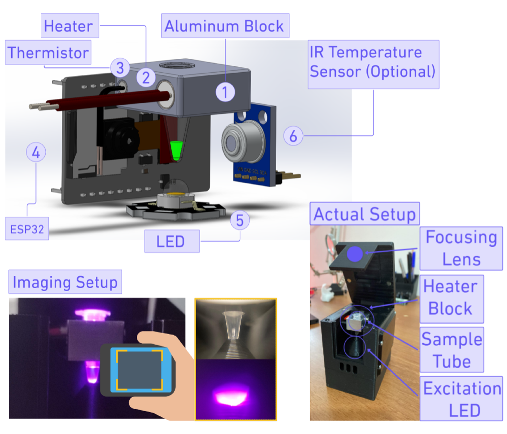
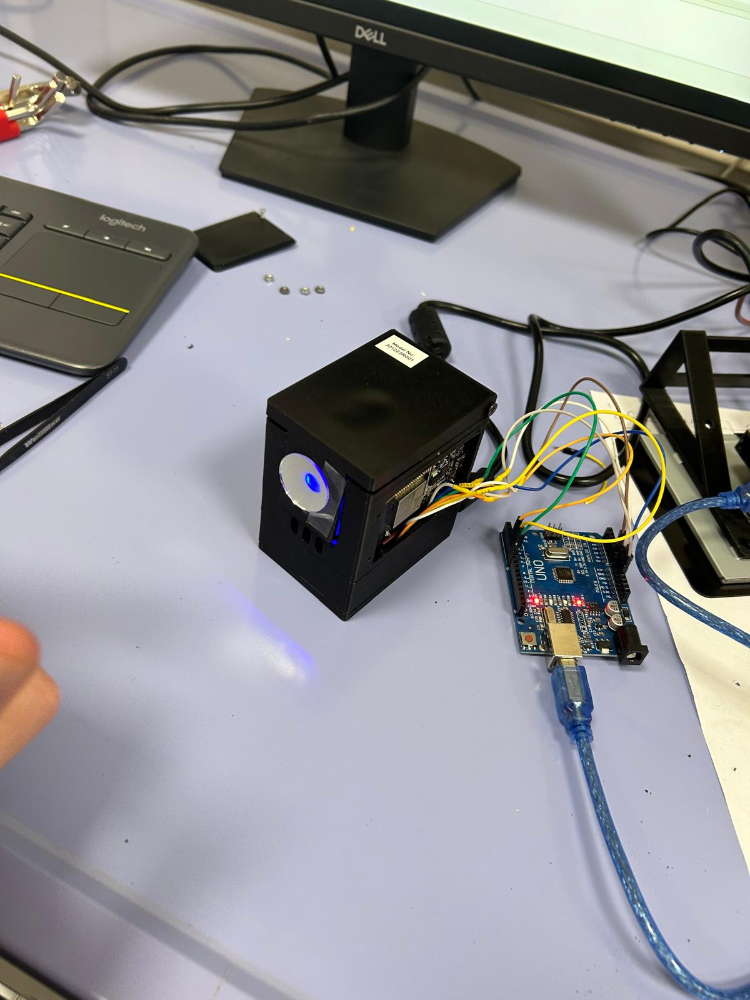

# 🧪 Reaction Vessel Temperature Controller for Monkey-Pox Diagnostics

A **low-cost**, **rapid**, and **portable point-of-care (PoC)** platform developed for the **diagnosis of the Mpox virus**.

This system integrates a **LAMP assay** (Loop-mediated Isothermal Amplification) and a custom-built **portable LAMP device** engineered to apply this molecular test in remote or resource-limited settings.

---

## 📸 System Overview

---

## 🎛️ GUI Interface – Enabling Interaction and Rapid Testing

  

---

## 🔬 Positive Sample Output (Mpox)

Image obtained from focusing lens showing a **positive reaction vessel** for Monkeypox.

---

## 🛠️ Troubleshooting View

A dedicated view showing external **microcontroller interface** used for system diagnostics and real-time debugging.

---

## 🚀 Highlights

- 📍 **Portable** design suitable for field use
- ⏱️ **Rapid amplification and detection** using LAMP
- 💡 **User-friendly GUI** for diagnostics workflow
- 🧰 **Hardware-software integration** with temperature control and result interpretation

---

> Developed for early detection and intervention in Monkeypox outbreaks, especially in low-resource environments.
